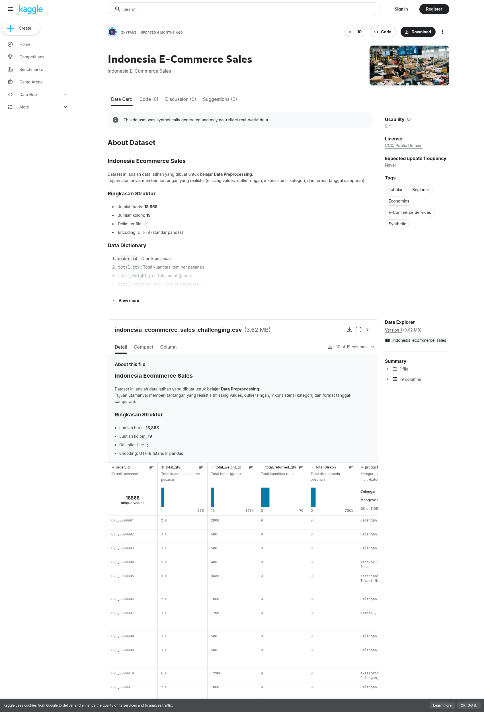
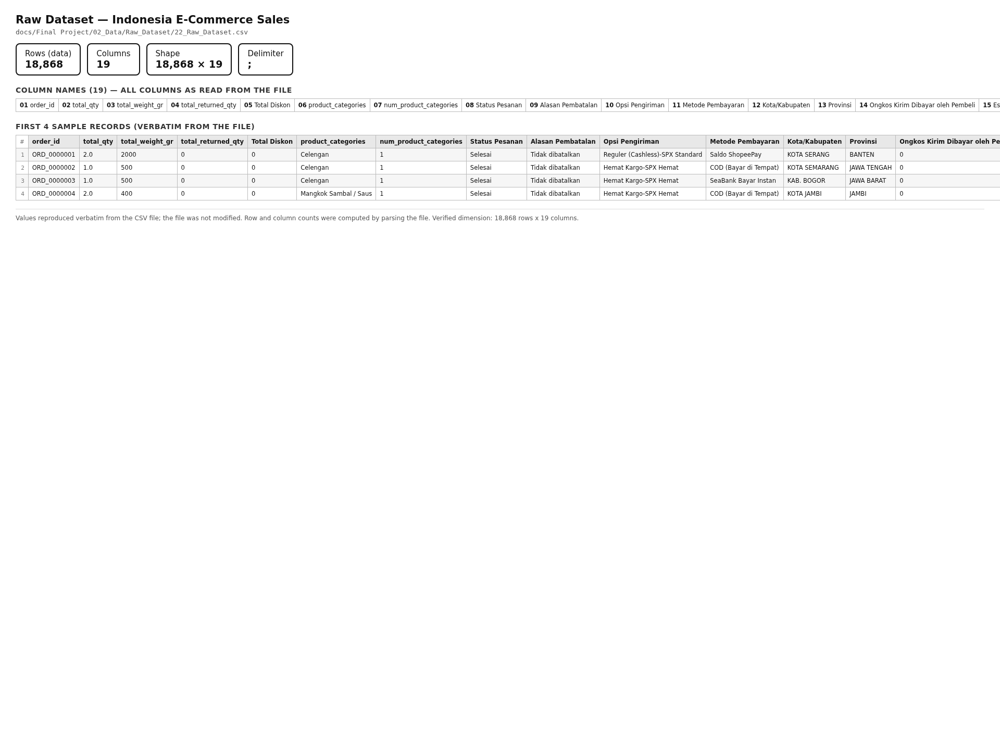
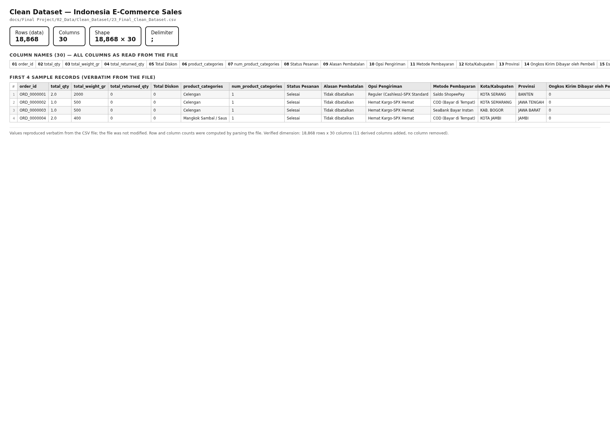
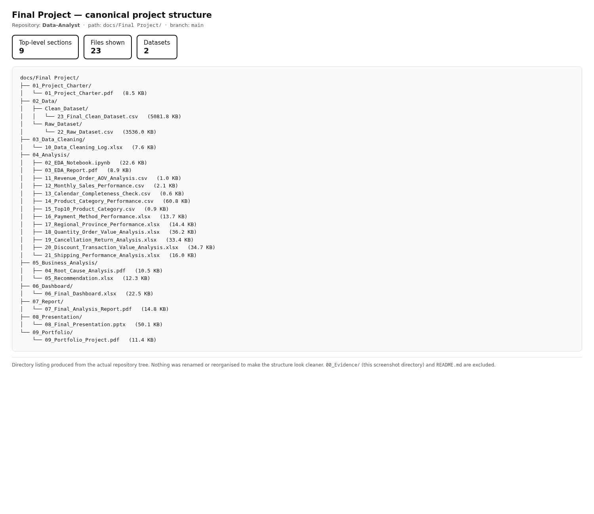
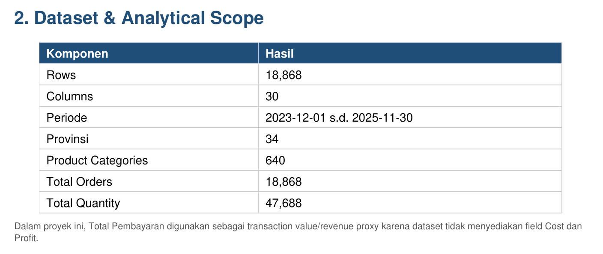
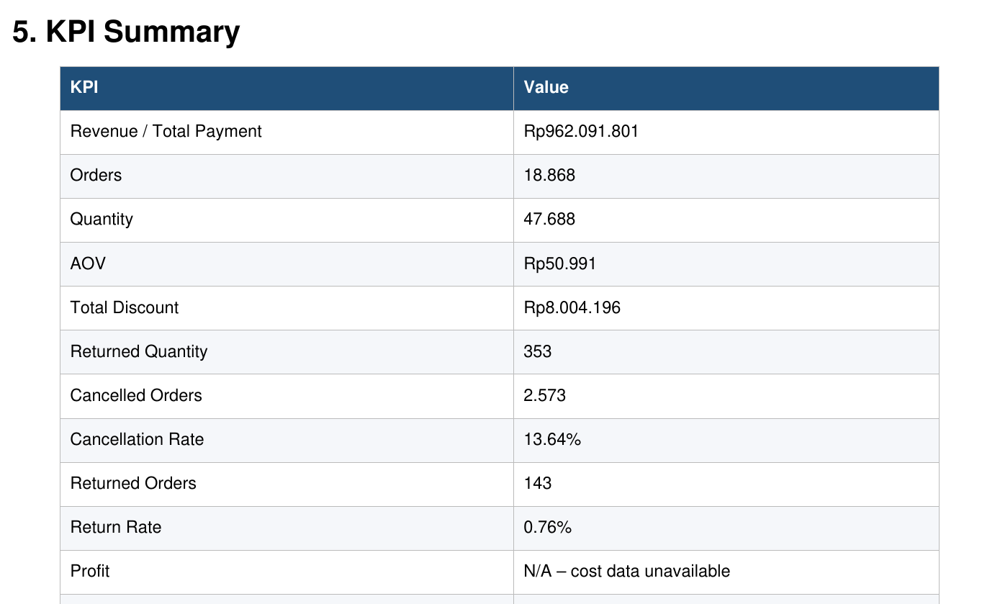

# Final Project — Indonesia E-Commerce Sales Analysis

Portfolio documentation for the Final Project of the Industry Simulation learning
path (Junior Data Analyst).

---

## 1. Project Overview

This project analyzes transaction-level e-commerce data for Indonesia to
understand sales performance, order behaviour, and fulfilment outcomes, and to
derive evidence-based insights and recommendations.

The dataset used here — **Indonesia E-Commerce Sales** — is used **only for this
Final Project**. It is not the dataset used throughout the weekly projects of
the learning path, and the findings in this document are not generalized to the
weekly projects.

This is a learning project. The business impact described here is the analytical
output of the study, not a measured commercial result.

---

## 2. Project Objective

The analytical objective of this project is to:

- Understand overall sales performance over the period covered by the dataset.
- Analyze orders, revenue, quantity sold, and discount behaviour.
- Examine cancellation and return patterns.
- Generate business insights from the available dataset fields.
- Formulate evidence-based recommendations tied to those insights.

---

## 3. Dataset

| Item | Information |
|---|---|
| Dataset | Indonesia E-Commerce Sales |
| Source | Kaggle |
| Dataset URL | https://www.kaggle.com/datasets/zkyfauzi/indonesia-ecommerce-sales |
| Usage | Final Project only |
| Raw dataset | `02_Data/Raw_Dataset/22_Raw_Dataset.csv` |
| Clean dataset | `02_Data/Clean_Dataset/23_Final_Clean_Dataset.csv` |
| Raw shape | 18,868 × 19 |
| Clean shape | 18,868 × 30 |
| License | CC0: Public Domain, as shown on the Kaggle dataset page recorded in section 4.1. |
| Version | Not recorded in this repository. |
| Publication date | Not recorded in this repository. |
| Access date | Not recorded in this repository. |
| Dataset author | Not recorded in this repository. The uploader is shown as `ZkyFauzi` on the Kaggle dataset page recorded in section 4.1, matching the `zkyfauzi` account in the dataset URL above. |

Row and column counts above were verified directly against the two CSV files in
this repository.

---

## 4. Dataset Evidence

This section records the evidence used to support the dataset facts stated above.
The evidence images below are grouped by where they come from:

- **Source evidence** — the published dataset page on Kaggle.
- **Dataset evidence** — the CSV files and directory structure in this repository.
- **Report-derived evidence** — pages cropped from the Final Project PDF reports
  that are already in this repository.

All six images are real captures. None is a mockup, placeholder, or recreated
page, and no project file was altered to produce them.

### 4.1 Kaggle Dataset Source

*Source evidence.* A capture of the live Kaggle page for the dataset URL given in
section 3. It shows the dataset title **Indonesia E-Commerce Sales**, the uploader
account, the About Dataset and Data Dictionary sections, the published structure
summary, and the license shown on that page. The page also carries a notice that
the dataset was synthetically generated — see section 11.

The page was loaded and captured directly; it was not rebuilt locally.



### 4.2 Raw Dataset

*Dataset evidence.* Rendered from `02_Data/Raw_Dataset/22_Raw_Dataset.csv`. It shows
the file name, its path in the repository, the verified shape of **18,868 rows ×
19 columns**, the delimiter, all 19 column names, and the first few sample records
reproduced verbatim. The CSV itself was not modified.



### 4.3 Clean Dataset

*Dataset evidence.* Rendered from `02_Data/Clean_Dataset/23_Final_Clean_Dataset.csv`.
It shows the file name, its path, the verified shape of **18,868 rows × 30 columns**,
all 30 column names, and sample records reproduced verbatim. The row count is
identical to the raw dataset, and the columns are additive. The CSV itself was not
modified.



### 4.4 Final Project Structure

*Repository evidence.* The actual directory listing of `docs/Final Project/`, showing
the nine top-level sections and the files inside them with their sizes. Nothing was
renamed or reorganised for presentation.



### 4.5 Data Overview

*Report-derived evidence.* Cropped from section **"2. Dataset & Analytical Scope"**
of `04_Analysis/03_EDA_Report.pdf`, a report already in this repository. It is a
page capture of that report, **not** a dashboard. It shows the reported scope:
18,868 rows, 30 columns, the period 2023-12-01 to 2025-11-30, 34 provinces, 640
product categories, 18,868 total orders, and 47,688 total quantity.



### 4.6 KPI Evidence

*Report-derived evidence.* Cropped from section **"5. KPI Summary"** of
`07_Report/07_Final_Analysis_Report.pdf`. It is a page capture of that report,
**not** a dashboard. It shows the reported values: revenue Rp962,091,801, 18,868
orders, 47,688 quantity, AOV Rp50,991, total discount Rp8,004,196, returned quantity
353, 2,573 cancelled orders, 13.64% cancellation rate, 143 returned orders, 0.76%
return rate, and profit marked as not available.

Every figure visible here was independently recalculated from
`02_Data/Clean_Dataset/23_Final_Clean_Dataset.csv` and matches, as recorded in
section 7.1. The two sources are therefore mutually corroborating: the figures come
from the project's own report, and the same figures were reproduced from the dataset
itself.



### 4.7 Columns added between the raw and clean dataset

| Added column | Purpose indicated by name |
|--------------|---------------------------|
| `order_datetime` | Parsed order timestamp |
| `order_date_clean` | Normalized order date |
| `Metode_Pembayaran_Clean` | Cleaned payment-method value |
| `Status_Analisis` | Consolidated order-status grouping |
| `Tahun` | Order year |
| `Bulan` | Order month |
| `Tahun_Bulan` | Year-month period key |
| `Hari` | Order day |
| `Hari_Minggu` | Order weekday |
| `Is_Cancelled` | Cancellation flag |
| `Is_Returned` | Return flag |

### 4.8 Other evidence available in this repository

| Evidence | Location | Status |
|----------|----------|--------|
| Cleaning record | `03_Data_Cleaning/10_Data_Cleaning_Log.xlsx` | Present — 2 worksheets |
| EDA notebook | `04_Analysis/02_EDA_Notebook.ipynb` | Present — 30 cells |
| Per-dimension analysis outputs | `04_Analysis/` | Present — 11 files |
| Root cause analysis | `05_Business_Analysis/04_Root_Cause_Analysis.pdf` | Present |
| Recommendations | `05_Business_Analysis/05_Recommendation.xlsx` | Present |
| Dashboard | `06_Dashboard/06_Final_Dashboard.xlsx` | Present — 12 worksheets |

---

## 5. Project Structure

Only paths that exist in this repository are listed.

```text
docs/Final Project/
├── 01_Project_Charter/
├── 02_Data/
│   ├── Raw_Dataset/
│   └── Clean_Dataset/
├── 03_Data_Cleaning/
├── 04_Analysis/
├── 05_Business_Analysis/
├── 06_Dashboard/
├── 07_Report/
├── 08_Presentation/
└── 09_Portfolio/
```

---

## 6. Data Preparation

The project keeps the original data and the prepared data in separate sections.

| Stage | Location | Output |
|-------|----------|--------|
| Raw dataset | `02_Data/Raw_Dataset/22_Raw_Dataset.csv` | Original file, 18,868 rows × 19 columns |
| Data preparation | `03_Data_Cleaning/10_Data_Cleaning_Log.xlsx` | 2 worksheets recording the preparation steps |
| Clean dataset | `02_Data/Clean_Dataset/23_Final_Clean_Dataset.csv` | 18,868 rows × 30 columns |

Key properties of the preparation, verified by comparing the two files:

- **Row count is preserved**: 18,868 rows in both the raw and the clean dataset.
- **Columns are additive**: 11 columns were added, and **no column was removed**.
- **Raw data is preserved**: the raw file remains in its own section and is not
  overwritten by the clean file.
- The added columns are derived fields for dates, status grouping, and
  cancellation/return flags, as listed in section 4.2.

The specific operations applied inside the preparation step are recorded in
`03_Data_Cleaning/10_Data_Cleaning_Log.xlsx`. No cleaning operation is claimed in
this README beyond what that log and the column comparison above show.

---

## 7. Key Metrics

### 7.1 Calculated and verified metrics

Each value below was recalculated directly from
`02_Data/Clean_Dataset/23_Final_Clean_Dataset.csv`.

| Metric | Value | Basis |
|--------|-------|-------|
| Revenue | Rp962,091,801 | Sum of `Total Pembayaran` across all 18,868 rows |
| Orders | 18,868 | Distinct `order_id` count |
| Quantity | 47,688 | Sum of `total_qty` |
| Discount | Rp8,004,196 | Sum of `Total Diskon` |
| Cancelled orders | 2,573 | Rows where `Is_Cancelled` is true |
| Cancellation rate | 13.64% | 2,573 ÷ 18,868 |
| Returned orders | 143 | Rows where `Is_Returned` is true |
| Return rate | 0.76% | 143 ÷ 18,868 |
| Returned quantity | 353 | Sum of `total_returned_qty` |

The order date range present in the dataset is **2023-12-01 to 2025-11-30**.

### 7.2 Unavailable metrics

| Metric | Status | Reason |
|--------|--------|--------|
| Profit | Not available | No profit column exists in the raw or clean dataset |
| Customers | Not available | No customer identifier column exists in the raw or clean dataset |

No profit or customer value is estimated or implied anywhere in this project.

---

## 8. Analysis Scope

The analysis areas below are supported by the columns present in the dataset and
by the output files present in `04_Analysis/`.

### 8.1 Verified dataset dimensions

| Dimension | Distinct values in clean dataset |
|-----------|----------------------------------|
| `product_categories` | 640 |
| `Metode_Pembayaran_Clean` | 13 |
| `Provinsi` | 34 |
| `Kota/Kabupaten` | 418 |
| `Opsi Pengiriman` | 45 |
| `Alasan Pembatalan` | 19 |
| Order period | 24 months, 2023-12 to 2025-11 |

### 8.2 Analysis outputs present in this project

| Area | Output file |
|------|-------------|
| Revenue, orders, average order value | `04_Analysis/11_Revenue_Order_AOV_Analysis.csv` |
| Monthly sales performance | `04_Analysis/12_Monthly_Sales_Performance.csv` |
| Calendar completeness check | `04_Analysis/13_Calendar_Completeness_Check.csv` |
| Product category performance | `04_Analysis/14_Product_Category_Performance.csv` |
| Top 10 product categories | `04_Analysis/15_Top10_Product_Category.csv` |
| Payment method performance | `04_Analysis/16_Payment_Method_Performance.xlsx` |
| Regional and province performance | `04_Analysis/17_Regional_Province_Performance.xlsx` |
| Quantity and order value | `04_Analysis/18_Quantity_Order_Value_Analysis.xlsx` |
| Cancellation and return | `04_Analysis/19_Cancellation_Return_Analysis.xlsx` |
| Discount and transaction value | `04_Analysis/20_Discount_Transaction_Value_Analysis.xlsx` |
| Shipping performance | `04_Analysis/21_Shipping_Performance_Analysis.xlsx` |
| Exploratory data analysis | `04_Analysis/02_EDA_Notebook.ipynb`, `04_Analysis/03_EDA_Report.pdf` |
| Root cause analysis | `05_Business_Analysis/04_Root_Cause_Analysis.pdf` |
| Recommendations | `05_Business_Analysis/05_Recommendation.xlsx` |

This README describes the scope of the analysis only. It does not restate
individual analytical findings; those are documented in the report, root cause
analysis, and recommendation files listed above.

---

## 9. Tools & Technologies

Listed only where project or repository evidence supports actual use.

| Tool | Evidence |
|------|----------|
| Python | Notebook language in `04_Analysis/02_EDA_Notebook.ipynb` |
| Pandas | Imported in `04_Analysis/02_EDA_Notebook.ipynb` |
| NumPy | Imported in `04_Analysis/02_EDA_Notebook.ipynb` |
| Jupyter Notebook | `04_Analysis/02_EDA_Notebook.ipynb` (30 cells) |
| Microsoft Excel | 8 `.xlsx` deliverables in `02_Data`…`06_Dashboard`, including `06_Dashboard/06_Final_Dashboard.xlsx` (12 sheets) |
| Git / GitHub | Repository history and directory structure of `docs/Final Project/` |

Additional data libraries are not listed here because no import of them appears
in the Final Project notebook. The Python environment used across the wider
repository is recorded separately in the repository root `requirements.txt`.

---

## 10. Project Deliverables

All paths below were verified to exist in this repository.

| Deliverable | Path | Detail |
|-------------|------|--------|
| Project Charter | `01_Project_Charter/01_Project_Charter.pdf` | PDF |
| Data | `02_Data/Raw_Dataset/22_Raw_Dataset.csv` | 18,868 × 19 |
| Data | `02_Data/Clean_Dataset/23_Final_Clean_Dataset.csv` | 18,868 × 30 |
| Data Cleaning | `03_Data_Cleaning/10_Data_Cleaning_Log.xlsx` | 2 worksheets |
| Analysis | `04_Analysis/02_EDA_Notebook.ipynb` | 30 cells |
| Analysis | `04_Analysis/03_EDA_Report.pdf` | PDF |
| Analysis | `04_Analysis/11_…_Analysis.csv` … `21_…_Analysis.xlsx` | 11 analysis outputs |
| Business Analysis | `05_Business_Analysis/04_Root_Cause_Analysis.pdf` | PDF |
| Business Analysis | `05_Business_Analysis/05_Recommendation.xlsx` | 6 sheets |
| Dashboard | `06_Dashboard/06_Final_Dashboard.xlsx` | 12 sheets |
| Report | `07_Report/07_Final_Analysis_Report.pdf` | PDF |
| Presentation | `08_Presentation/08_Final_Presentation.pptx` | 50 KB |
| Portfolio | `09_Portfolio/09_Portfolio_Project.pdf` | PDF |

---

## 11. Limitations

- **The dataset is synthetically generated.** The Kaggle source page carries a
  notice stating that the dataset was synthetically generated and may not reflect
  real-world data, and the About Dataset section describes it as practice data with
  injected preprocessing challenges. This evidence is recorded in section 4.1, and
  it means the findings describe this dataset rather than observed market behaviour.
- **Profit is unavailable.** There is no profit column in the dataset, so this
  project cannot report margin or profitability.
- **Customer-level information is unavailable.** There is no customer identifier
  column, so no per-customer, cohort, or retention analysis is possible.
- **Conclusions are limited to the available dataset fields.** Any question that
  requires profit, customer identity, cost, or inventory data is out of scope for
  this dataset.
- **Findings should not be generalized** beyond the dataset population and its
  time coverage, which spans order dates from 2023-12-01 to 2025-11-30.
- **Scope of the dataset.** The analysis describes the orders contained in this
  dataset. It does not describe the full Indonesian e-commerce market.

---

## 12. Dataset Attribution

This project uses the **Indonesia E-Commerce Sales** dataset, published on
Kaggle.

> **Indonesia E-Commerce Sales** — Kaggle
> https://www.kaggle.com/datasets/zkyfauzi/indonesia-ecommerce-sales

The dataset license, version, publication date, access date, and author details
are **not recorded in this repository** and are not stated here. Anyone reusing
this project should confirm those terms on the Kaggle dataset page before
distributing the data or derived outputs.

---

## 13. Status

This README documents the Final Project dataset and project structure for
portfolio purposes.

| Item | Status |
|------|--------|
| Project charter | Complete — `01_Project_Charter/01_Project_Charter.pdf` |
| Raw dataset | Complete — 18,868 × 19 |
| Data preparation | Complete — 30 columns, 11 derived |
| Analysis outputs | Complete — 11 files in `04_Analysis/` |
| Business analysis | Complete — root cause analysis and recommendations |
| Dashboard, report, presentation, portfolio | Complete |
| Dataset screenshots | Captured — 6 evidence images, see section 4 |

The Indonesia E-Commerce Sales dataset applies to `docs/Final Project/` only. It
is not used in the weekly project folders of this repository.
