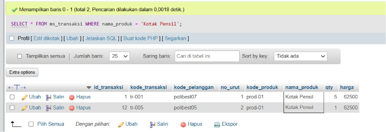
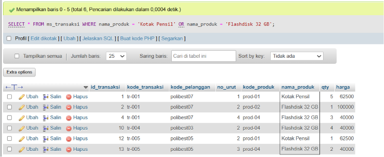
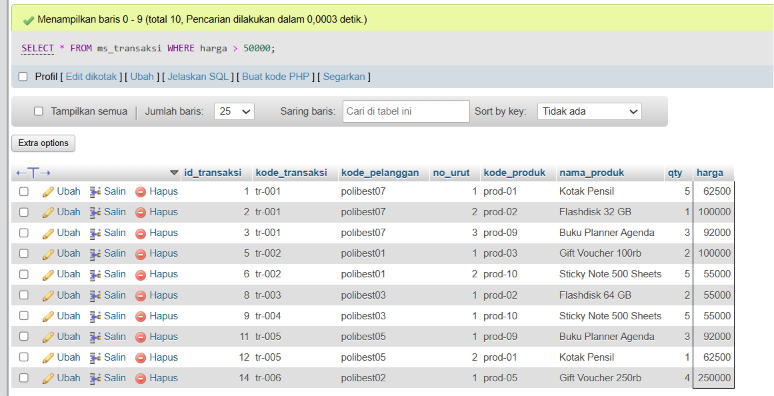
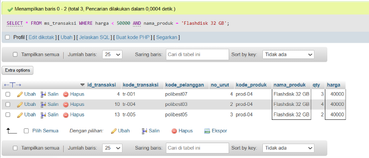
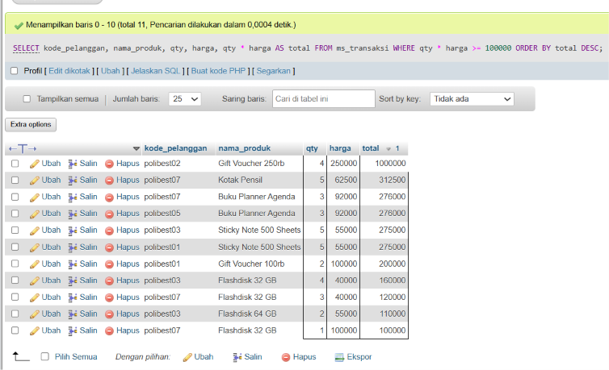

# Project 03 - SQL Filtering & Transaction Analysis

## 1. Project Overview

Project 03 focuses on SQL filtering and basic transaction analysis using the `WHERE` clause.

The project introduces several fundamental SQL concepts, including:

- `WHERE`
- `OR`
- Comparison operators
- `AND`
- Calculated columns
- Column aliases
- `ORDER BY`
- `DESC`

The exercises use transaction data stored in the `ms_transaksi` table.

---

## 2. Environment

The exercises were performed using:

- XAMPP
- MySQL
- phpMyAdmin

XAMPP was used as the local development environment, while MySQL was used to execute SQL queries through phpMyAdmin.

---

## 3. Database and Table

The main table used in this project is:

```text
ms_transaksi
```

The table contains transaction information with the following columns:

- `id_transaksi`
- `kode_transaksi`
- `kode_pelanggan`
- `no_urut`
- `kode_produk`
- `nama_produk`
- `qty`
- `harga`

The `qty` and `harga` columns are especially important for the transaction analysis in Quiz 5.

---

# 4. Quiz Exercises

## Quiz 1 - WHERE

### Objective

Filter transaction data based on a specific product name.

### Query

```sql
SELECT *
FROM ms_transaksi
WHERE nama_produk = 'Kotak Pensil';
```

### Explanation

The `WHERE` clause is used to filter rows based on a specific condition.

In this query, only transactions where the `nama_produk` value is `Kotak Pensil` are displayed.

The basic structure is:

```text
SELECT
    ↓
FROM
    ↓
WHERE condition
    ↓
Filtered result
```

### Evidence



---

## Quiz 2 - WHERE + OR

### Objective

Filter transactions based on more than one possible product.

### Query

```sql
SELECT *
FROM ms_transaksi
WHERE nama_produk = 'Kotak Pensil'
   OR nama_produk = 'Flashdisk 32 GB';
```

### Explanation

The `OR` operator allows a query to return data when at least one of the specified conditions is true.

The query returns transactions where the product is either:

- `Kotak Pensil`
- `Flashdisk 32 GB`

The logical structure is:

```text
Condition A
    OR
Condition B
    ↓
Either condition can be TRUE
```

### Evidence



---

## Quiz 3 - WHERE with Comparison Operator

### Objective

Display transactions with a price greater than 50,000.

### Query

```sql
SELECT *
FROM ms_transaksi
WHERE harga > 50000;
```

### Explanation

The `>` comparison operator is used to filter numerical values.

In this query:

```text
harga > 50000
```

means that only transactions with a price greater than 50,000 are displayed.

Some common comparison operators in SQL are:

| Operator | Meaning |
|---|---|
| `>` | Greater than |
| `<` | Less than |
| `=` | Equal to |
| `>=` | Greater than or equal to |
| `<=` | Less than or equal to |
| `<>` | Not equal to |

### Evidence



---

## Quiz 4 - WHERE + AND

### Objective

Filter transactions using two conditions simultaneously.

### Query

```sql
SELECT *
FROM ms_transaksi
WHERE harga < 50000
  AND nama_produk = 'Flashdisk 32 GB';
```

### Explanation

The `AND` operator requires all specified conditions to be true.

In this query, the transaction must satisfy both conditions:

```text
harga < 50000
        AND
nama_produk = 'Flashdisk 32 GB'
```

Therefore, the result only contains `Flashdisk 32 GB` transactions with a price below 50,000.

The difference between `AND` and `OR` is:

```text
AND → all conditions must be TRUE
OR  → at least one condition must be TRUE
```

### Evidence



---

# 5. Quiz 5 - Mini Project Transaction Analysis

## Objective

Analyze transactions with a minimum total transaction value of 100,000.

The total transaction value is calculated using:

```text
total = qty × harga
```

The result is then sorted from the highest total transaction value to the lowest.

### Query

```sql
SELECT
    kode_pelanggan,
    nama_produk,
    qty,
    harga,
    qty * harga AS total
FROM ms_transaksi
WHERE qty * harga >= 100000
ORDER BY total DESC;
```

### Explanation

This query combines several SQL concepts learned in the previous exercises.

### 1. Selecting specific columns

The query displays:

```text
kode_pelanggan
nama_produk
qty
harga
```

It does not display every column from the table.

### 2. Calculated column

The total transaction value is calculated using:

```sql
qty * harga
```

The result is given the alias:

```sql
AS total
```

Therefore, the output contains a new column named `total`.

### 3. Filtering the transaction total

The query uses:

```sql
WHERE qty * harga >= 100000
```

This means only transactions with a total value of at least 100,000 are displayed.

### 4. Sorting the result

The query uses:

```sql
ORDER BY total DESC
```

`ORDER BY` is used to sort the result, while `DESC` means descending order.

Therefore, the transaction with the highest total value appears first.

### Example calculation

If a transaction has:

```text
qty   = 5
harga = 62,500
```

then:

```text
total = 5 × 62,500
      = 312,500
```

Because 312,500 is greater than 100,000, the transaction meets the filtering condition.

### Evidence



---

# 6. SQL Concepts Practiced

| Concept | Purpose |
|---|---|
| `WHERE` | Filter rows based on a condition |
| `OR` | Allow one of multiple conditions to be true |
| `AND` | Require multiple conditions to be true |
| `>` | Filter values greater than a specific number |
| `<` | Filter values less than a specific number |
| `>=` | Filter values greater than or equal to a number |
| `AS` | Create an alias for a calculated column |
| `ORDER BY` | Sort query results |
| `DESC` | Sort data in descending order |

---

# 7. Learning Outcome

After completing Project 03, I understand how to:

- Filter data using the `WHERE` clause.
- Use `AND` and `OR` to combine conditions.
- Apply comparison operators to numerical data.
- Create calculated columns using arithmetic operations.
- Rename calculated columns using aliases.
- Filter data based on calculated values.
- Sort query results using `ORDER BY`.
- Sort data from highest to lowest using `DESC`.

---

# 8. Project Files

```text
Project 3/
├── images/
│   ├── quiz-1.png
│   ├── quiz-2.png
│   ├── quiz-3.png
│   ├── quiz-4.png
│   └── quiz-5.png
│
├── queries.sql
└── SQL Fundamentals Documentation.md
```

---

# 9. Conclusion

Project 03 provided practical experience with SQL filtering and basic transaction analysis.

The project started with simple filtering using `WHERE`, followed by the use of `OR` and comparison operators. The exercises then introduced `AND` for combining multiple conditions.

The final mini project combined filtering, arithmetic calculations, column aliases, and sorting to identify transactions with a total value of at least 100,000.

These concepts provide an important foundation for performing more advanced SQL analysis and extracting useful information from transactional datasets.
