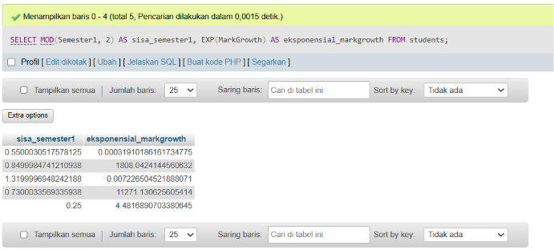
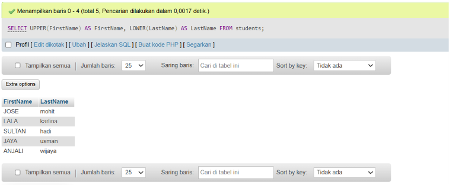
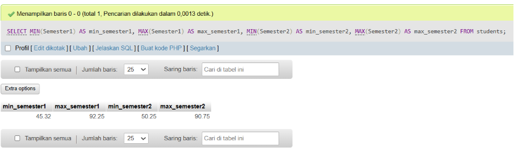

# Project 04 - SQL Functions

## 1. Project Overview

Project 04 focuses on the use of SQL functions for processing and analyzing data.

The material covers several types of SQL functions, including:

* Mathematical Scalar Functions
* Text Functions
* Aggregate Functions

The exercises use the `students` table and demonstrate how SQL functions can be applied directly within a `SELECT` statement.

---

## 2. Environment

The exercises were performed using:

* XAMPP
* MySQL
* phpMyAdmin

XAMPP was used as the local development environment, while MySQL was used to execute the SQL queries through phpMyAdmin.

---

## 3. Database and Table

The main table used in this project is:

```text
students
```

The table contains student information and academic scores, including:

* `StudentID`
* `FirstName`
* `LastName`
* `Email`
* `Semester1`
* `Semester2`
* `MarkGrowth`

The columns `Semester1`, `Semester2`, `MarkGrowth`, `FirstName`, and `LastName` are used in the exercises.

---

# 4. Quiz Exercises

## Quiz 1 - MOD() and EXP()

### Objective

Use the `MOD()` function to calculate the remainder when `Semester1` is divided by 2 and use the `EXP()` function to calculate the exponential value of `MarkGrowth`.

Both functions are used in the same `SELECT` statement.

### Query

```sql
SELECT
    MOD(Semester1, 2) AS sisa_semester1,
    EXP(MarkGrowth) AS eksponensial_markgrowth
FROM students;
```

### Explanation

The `MOD()` function returns the remainder of a division.

In this query:

```sql
MOD(Semester1, 2)
```

calculates the remainder when the `Semester1` value is divided by 2.

The `EXP()` function calculates the exponential value of `MarkGrowth`.

```sql
EXP(MarkGrowth)
```

The results are given aliases to make the output easier to understand:

```text
sisa_semester1
eksponensial_markgrowth
```

### Evidence



---

## Quiz 2 - UPPER() and LOWER()

### Objective

Use the `UPPER()` function to convert the `FirstName` column to uppercase and use the `LOWER()` function to convert the `LastName` column to lowercase.

Both functions are used in the same `SELECT` statement.

### Query

```sql
SELECT
    UPPER(FirstName) AS FirstName,
    LOWER(LastName) AS LastName
FROM students;
```

### Explanation

The `UPPER()` function converts text into uppercase letters.

```sql
UPPER(FirstName)
```

The `LOWER()` function converts text into lowercase letters.

```sql
LOWER(LastName)
```

For example, a name such as:

```text
Jose Mohit
```

can be displayed as:

```text
JOSE mohit
```

The original data in the database is not permanently changed. The functions only modify how the values are displayed in the query result.

### Evidence



---

## Quiz 3 - MIN() and MAX()

### Objective

Use the `MIN()` and `MAX()` aggregate functions to calculate the minimum and maximum values from the `Semester1` and `Semester2` columns.

Both functions are used in the same `SELECT` statement.

### Query

```sql
SELECT
    MIN(Semester1) AS min_semester1,
    MAX(Semester1) AS max_semester1,
    MIN(Semester2) AS min_semester2,
    MAX(Semester2) AS max_semester2
FROM students;
```

### Explanation

The `MIN()` function returns the smallest value from a column.

```sql
MIN(Semester1)
MIN(Semester2)
```

The `MAX()` function returns the largest value from a column.

```sql
MAX(Semester1)
MAX(Semester2)
```

The query therefore produces four results:

* Minimum `Semester1`
* Maximum `Semester1`
* Minimum `Semester2`
* Maximum `Semester2`

These functions are useful for identifying the lowest and highest values in a dataset.

### Evidence



---

# 5. SQL Functions Practiced

| Function  | Purpose                             |
| --------- | ----------------------------------- |
| `MOD()`   | Returns the remainder of a division |
| `EXP()`   | Calculates an exponential value     |
| `UPPER()` | Converts text to uppercase          |
| `LOWER()` | Converts text to lowercase          |
| `MIN()`   | Returns the minimum value           |
| `MAX()`   | Returns the maximum value           |

---

# 6. Learning Outcome

After completing Project 04, I understand how to:

* Apply mathematical functions in SQL.
* Calculate remainders using `MOD()`.
* Calculate exponential values using `EXP()`.
* Transform text using `UPPER()` and `LOWER()`.
* Find minimum values using `MIN()`.
* Find maximum values using `MAX()`.
* Combine SQL functions within a `SELECT` statement.
* Use aliases to make query results easier to understand.

---

# 7. Project Files

```text
Project 4/
├── image/
│   ├── quiz-1.png
│   ├── quiz-2.png
│   └── quiz-3.png
│
├── queries.sql
└── SQL Fundamentals Documentation.md
```

---

# 8. Conclusion

Project 04 provided practical experience with several SQL functions for data processing and analysis.

The first exercise introduced mathematical functions through `MOD()` and `EXP()`. The second exercise focused on text manipulation using `UPPER()` and `LOWER()`. The final exercise introduced aggregate functions through `MIN()` and `MAX()`.

These functions provide useful tools for transforming, calculating, and summarizing data directly within SQL queries.
