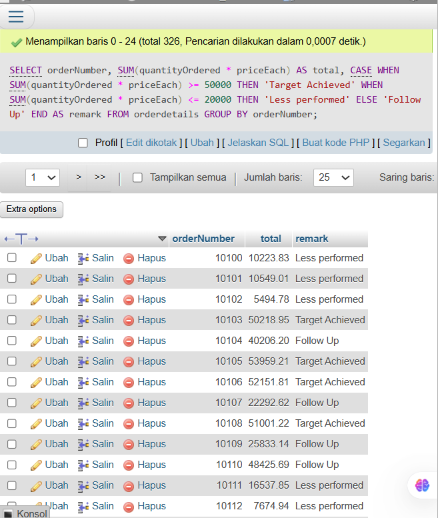
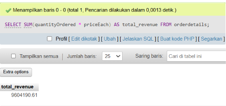
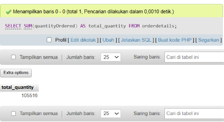
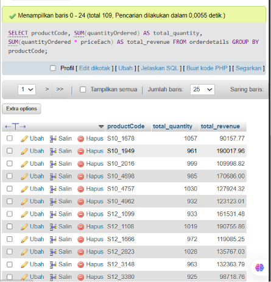
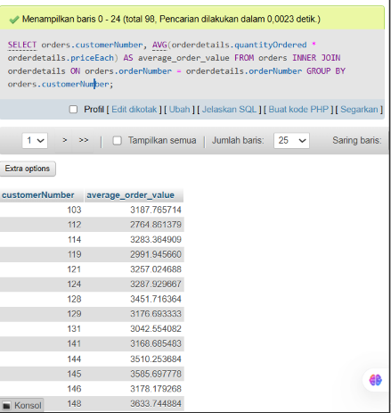
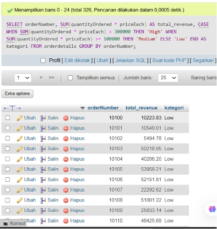

Iya, sekarang saya paham maksudmu. Yang kamu inginkan bukan materi yang dipisah menjadi terlalu banyak bagian, tetapi format dokumentasi yang alurnya seperti Project 4: satu bagian `Quiz Exercises`, kemudian tiap quiz dijelaskan dengan `Objective → Query → Explanation → Evidence`.

Berikut versi final Project 5 dengan format tersebut, dan tetap menggunakan `orders` serta `orderdetails`.

````markdown
# Project 05 - GROUP BY, Aggregate Function & CASE WHEN

## 1. Project Overview

Project 05 focuses on grouping and summarizing data using SQL aggregate functions and conditional statements.

The main concepts practiced in this project are:

- `GROUP BY`
- Aggregate Functions
- `SUM()`
- `AVG()`
- `CASE WHEN`
- Calculated columns
- `INNER JOIN`

The exercises use the `orders` and `orderdetails` tables.

---

## 2. Environment

The exercises were performed using:

- XAMPP
- MySQL
- phpMyAdmin

XAMPP was used as the local development environment, while MySQL was used to execute the SQL queries through phpMyAdmin.

---

## 3. Database and Tables

The main tables used in this project are:

```text
orders
orderdetails
````

The relationship between the two tables is based on:

```text
orders.orderNumber
        =
orderdetails.orderNumber
```

The `orderNumber` column is used to connect related order records with their corresponding order details.

---

# 4. Quiz Exercises

## Quiz 1 - GROUP BY, SUM() and CASE WHEN

### Objective

Calculate the total value of each order and classify the result using a `CASE WHEN` statement.

The total value is calculated using:

```text
quantityOrdered × priceEach
```

The classification rules are:

```text
>= 50,000  → Target Achieved
<= 20,000  → Less performed
Other      → Follow Up
```

### Query

```sql
SELECT
    orderNumber,
    SUM(quantityOrdered * priceEach) AS total,
    CASE
        WHEN SUM(quantityOrdered * priceEach) >= 50000
            THEN 'Target Achieved'
        WHEN SUM(quantityOrdered * priceEach) <= 20000
            THEN 'Less performed'
        ELSE 'Follow Up'
    END AS remark
FROM orderdetails
GROUP BY orderNumber;
```

### Explanation

The `SUM()` function calculates the total value of each order:

```sql
SUM(quantityOrdered * priceEach)
```

The `GROUP BY` clause groups the records based on:

```sql
orderNumber
```

The `CASE WHEN` statement then classifies each order based on its total value.

### Evidence



---

## Quiz 2 - Aggregate Analysis

### Objective

Perform basic analysis on the order data using aggregate functions and grouping.

The analysis includes:

1. Total revenue
2. Total quantity
3. Total quantity and revenue for each product
4. Average order value for each customer
5. Revenue categorization

---

### 1. Total Revenue

```sql
SELECT
    SUM(quantityOrdered * priceEach) AS total_revenue
FROM orderdetails;
```

The query calculates the total revenue from all order details by multiplying `quantityOrdered` by `priceEach`, then adding all values using `SUM()`.

### Evidence



---

### 2. Total Quantity

```sql
SELECT
    SUM(quantityOrdered) AS total_quantity
FROM orderdetails;
```

The query calculates the total number of products ordered by adding all values in the `quantityOrdered` column.

### Evidence



---

### 3. Total Quantity and Revenue by Product

```sql
SELECT
    productCode,
    SUM(quantityOrdered) AS total_quantity,
    SUM(quantityOrdered * priceEach) AS total_revenue
FROM orderdetails
GROUP BY productCode;
```

The `GROUP BY productCode` clause groups the order details by product.

For each product, the query calculates:

* Total quantity ordered
* Total revenue

### Evidence



---

### 4. Average Order Value by Customer

```sql
SELECT
    orders.customerNumber,
    AVG(orderdetails.quantityOrdered * orderdetails.priceEach)
        AS average_order_value
FROM orders
INNER JOIN orderdetails
    ON orders.orderNumber = orderdetails.orderNumber
GROUP BY orders.customerNumber;
```

The `orders` and `orderdetails` tables are combined using `INNER JOIN`.

The relationship between the tables is defined by:

```sql
orders.orderNumber = orderdetails.orderNumber
```

The `AVG()` function calculates the average order value for each customer.

The results are grouped using:

```sql
orders.customerNumber
```

### Evidence



---

### 5. Revenue Categorization

```sql
SELECT
    orderNumber,
    SUM(quantityOrdered * priceEach) AS total_revenue,
    CASE
        WHEN SUM(quantityOrdered * priceEach) > 300000
            THEN 'High'
        WHEN SUM(quantityOrdered * priceEach) >= 100000
            THEN 'Medium'
        ELSE 'Low'
    END AS kategori
FROM orderdetails
GROUP BY orderNumber;
```

The query calculates the total revenue for each order and then categorizes it using `CASE WHEN`.

The categories are:

```text
> 300,000       → High
100,000–300,000 → Medium
< 100,000       → Low
```

### Evidence



---

# 5. SQL Concepts Practiced

| Concept      | Purpose                                   |
| ------------ | ----------------------------------------- |
| `GROUP BY`   | Groups records based on a specific column |
| `SUM()`      | Calculates the total value                |
| `AVG()`      | Calculates the average value              |
| `CASE WHEN`  | Applies conditional logic                 |
| `INNER JOIN` | Combines related records from two tables  |
| `AS`         | Creates an alias for a column             |
| `*`          | Performs multiplication                   |

---

# 6. Learning Outcome

After completing Project 05, I understand how to:

* Group records using `GROUP BY`.
* Calculate total values using `SUM()`.
* Calculate average values using `AVG()`.
* Create calculated columns from existing data.
* Apply conditional logic using `CASE WHEN`.
* Categorize numerical results based on predefined conditions.
* Combine related data using `INNER JOIN`.
* Perform basic aggregation analysis on order data.

---

# 7. Project Files

```text
Project 5/
├── image/
│   ├── quiz-1.png
│   ├── quiz-2.1.png
│   ├── quiz-2.2.png
│   ├── quiz-2.3.png
│   ├── quiz-2.4.png
│   └── quiz-2.5.png
│
├── orders.sql
├── orderdetails.sql
├── queries.sql
└── SQL Fundamentals Documentation.md
```

---

# 8. Conclusion

Project 05 provided practical experience in grouping, aggregating, and categorizing data using SQL.

The project demonstrated how `GROUP BY` can be combined with aggregate functions such as `SUM()` and `AVG()` to produce summarized information. The `CASE WHEN` statement was also used to classify order revenue into different categories.

The project also demonstrated the use of `INNER JOIN` when customer information from the `orders` table needs to be combined with order details from the `orderdetails` table.

These concepts provide a foundation for performing more structured data analysis using SQL.

```

Ini formatnya sekarang konsisten dengan contoh Project 4 yang kamu berikan: tidak terlalu terpecah, tetap enak dibaca di GitHub, dan screenshot langsung ditempatkan pada bagian evidence masing-masing.
```
