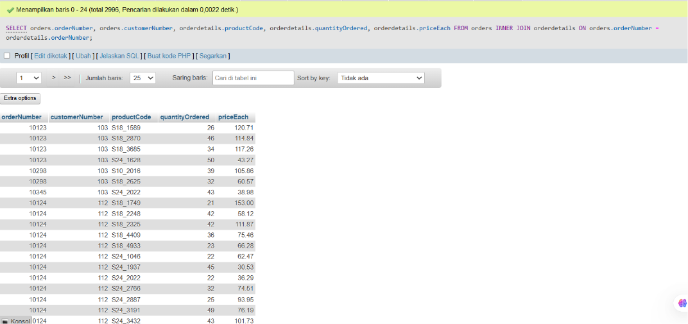
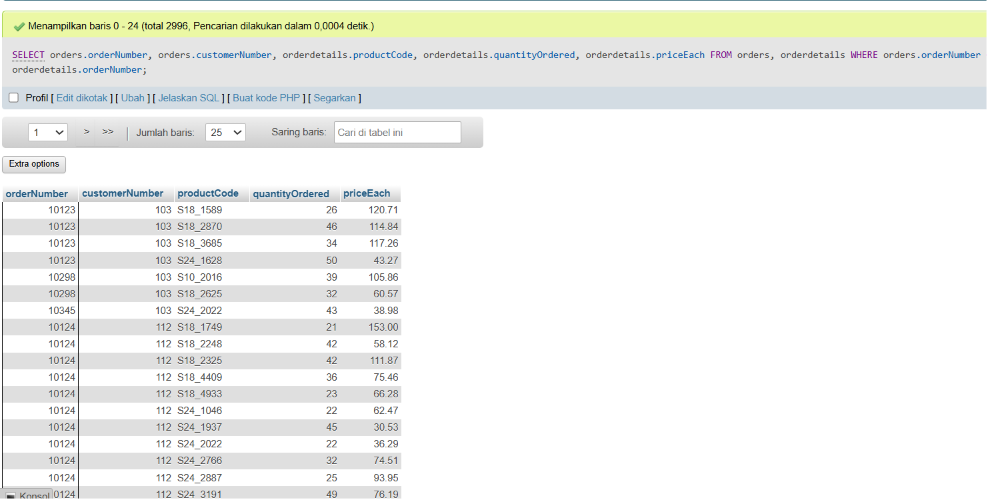
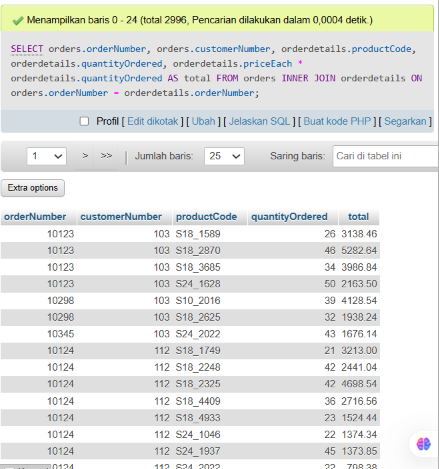

# Project 05 - SQL JOIN

## 1. Project Overview

Project 05 focuses on combining data from multiple tables using SQL JOIN operations.

The main concepts practiced in this project are:

* Key columns
* Table relationships
* `INNER JOIN`
* `JOIN ... ON`
* Joining tables using `WHERE`
* Table prefixes
* Calculated columns

The exercises use the `orders` and `orderdetails` tables.

---

## 2. Environment

The exercises were performed using:

* XAMPP
* MySQL
* phpMyAdmin

XAMPP was used as the local development environment, while MySQL was used to execute the SQL queries through phpMyAdmin.

---

## 3. Database and Tables

The main tables used in this project are:

```text
orders
orderdetails
```

The relationship between the two tables is based on:

```text
orders.orderNumber
        =
orderdetails.orderNumber
```

The `orderNumber` column acts as the key used to connect the related records from both tables.

---

# 4. Quiz Exercises

## Quiz 1 - INNER JOIN

### Objective

Combine data from the `orders` and `orderdetails` tables using an `INNER JOIN`.

### Query

```sql
SELECT
    orders.orderNumber,
    orders.customerNumber,
    orderdetails.productCode,
    orderdetails.quantityOrdered,
    orderdetails.priceEach
FROM orders
INNER JOIN orderdetails
    ON orders.orderNumber = orderdetails.orderNumber;
```

### Explanation

The `INNER JOIN` combines records from two tables when the values in the specified key columns match.

The join condition is:

```sql
orders.orderNumber = orderdetails.orderNumber
```

The query uses table prefixes such as:

```text
orders.orderNumber
orderdetails.productCode
```

This makes it clear which table each column comes from.

### Evidence



---

## Quiz 1 - Alternative Query

### Objective

Produce the same result as the `INNER JOIN` query using another SQL approach.

### Query

```sql
SELECT
    orders.orderNumber,
    orders.customerNumber,
    orderdetails.productCode,
    orderdetails.quantityOrdered,
    orderdetails.priceEach
FROM orders, orderdetails
WHERE orders.orderNumber = orderdetails.orderNumber;
```

### Explanation

This query combines the two tables using the `WHERE` clause instead of explicitly writing `INNER JOIN`.

The joining condition remains the same:

```sql
orders.orderNumber = orderdetails.orderNumber
```

Therefore, the result represents the same relationship between the two tables.

This demonstrates that an `INNER JOIN ... ON` query can produce the same result as a query that uses the table combination together with a matching condition in `WHERE`.

### Evidence



---

# 5. Quiz 2 - JOIN and Calculated Column

## Objective

Combine the `orders` and `orderdetails` tables and calculate the total value of each order detail.

The total is calculated using:

```text
total = priceEach × quantityOrdered
```

### Query

```sql
SELECT
    orders.orderNumber,
    orders.customerNumber,
    orderdetails.productCode,
    orderdetails.priceEach,
    orderdetails.quantityOrdered,
    orderdetails.priceEach * orderdetails.quantityOrdered AS total
FROM orders
INNER JOIN orderdetails
    ON orders.orderNumber = orderdetails.orderNumber;
```

### Explanation

The query retrieves information from both tables.

The selected columns are:

```text
orderNumber
customerNumber
productCode
priceEach
quantityOrdered
total
```

The `total` column is not stored directly as a column in the query result. It is calculated using:

```sql
orderdetails.priceEach * orderdetails.quantityOrdered
```

The `AS total` syntax gives the calculated value the column name `total`.

### Example Calculation

If a transaction has:

```text
quantityOrdered = 30
priceEach       = 136.00
```

then:

```text
total = 30 × 136.00
      = 4080.00
```

### Evidence



---

# 6. SQL Concepts Practiced

| Concept                 | Purpose                                   |
| ----------------------- | ----------------------------------------- |
| Key Column              | Connect related data between tables       |
| `INNER JOIN`            | Combine matching records from two tables  |
| `JOIN ... ON`           | Define the relationship between tables    |
| `WHERE`                 | Apply a matching condition between tables |
| Table Prefix            | Identify the source table of a column     |
| `AS`                    | Give an alias to a calculated column      |
| Arithmetic Operator `*` | Calculate the total value                 |

---

# 7. Learning Outcome

After completing Project 05, I understand how to:

* Identify key columns between related tables.
* Combine data from two different tables.
* Use `INNER JOIN` to retrieve matching records.
* Define relationships using `JOIN ... ON`.
* Understand the alternative use of `WHERE` for matching records.
* Use table prefixes when working with multiple tables.
* Create calculated columns from existing data.
* Use aliases to make calculated columns easier to understand.

---

# 8. Project Files

```text
Project 5/
├── image/
│   ├── quiz-1-inner-join.png
│   ├── quiz-1-alternative.png
│   └── quiz-2.png
│
└── query.sql
```

---

# 9. Conclusion

Project 05 introduced the fundamental concept of combining data from multiple SQL tables.

The first exercise demonstrated how related records can be combined using `INNER JOIN` and how the same matching logic can also be implemented using `WHERE`.

The second exercise extended the JOIN concept by combining data from both tables and creating a calculated `total` column using multiplication.

Understanding table relationships, key columns, and JOIN operations is an important foundation for performing analysis across multiple related datasets.
