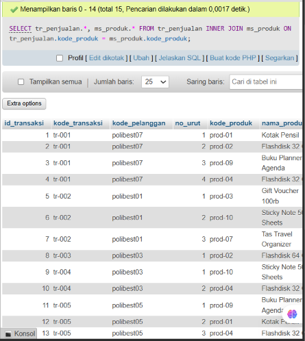
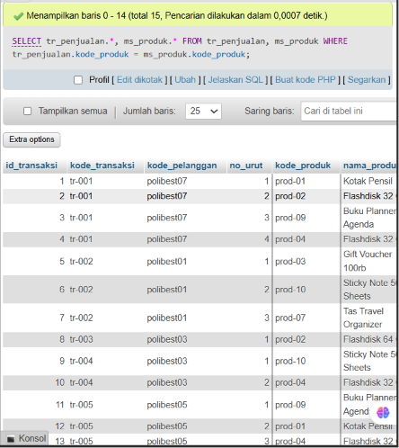
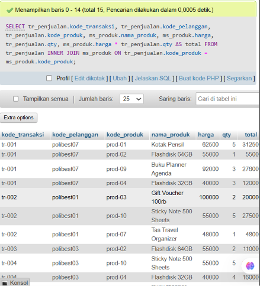

````markdown
# Project 06 - SQL JOIN

## 1. Project Overview

Project 06 focuses on combining data from multiple tables using SQL JOIN operations.

The main concepts practiced in this project are:

- Key columns
- Table relationships
- `INNER JOIN`
- `JOIN ... ON`
- Using `WHERE` as an alternative join condition
- Table prefixes
- Calculated columns

The exercises use the `tr_penjualan` and `ms_produk` tables.

---

## 2. Environment

The exercises were performed using:

- XAMPP
- MySQL
- phpMyAdmin

XAMPP was used as the local development environment, while MySQL was used to execute the SQL queries through phpMyAdmin.

---

## 3. Database and Tables

The main tables used in this project are:

```text
tr_penjualan
ms_produk
````

The relationship between the two tables is based on the `kode_produk` column:

```text
tr_penjualan.kode_produk
        =
ms_produk.kode_produk
```

The `kode_produk` column is used as the key column to connect the related records between the two tables.

The `tr_penjualan` table contains transaction information, while the `ms_produk` table contains product information.

---

# 4. Quiz Exercises

## Quiz 1 - INNER JOIN

### Objective

Combine data from the `tr_penjualan` and `ms_produk` tables using an `INNER JOIN`.

### Query

```sql
SELECT
    tr_penjualan.*,
    ms_produk.*
FROM tr_penjualan
INNER JOIN ms_produk
    ON tr_penjualan.kode_produk = ms_produk.kode_produk;
```

### Explanation

The `INNER JOIN` combines records from both tables when the value of `kode_produk` matches.

The join condition is:

```sql
tr_penjualan.kode_produk = ms_produk.kode_produk
```

Table prefixes are used to clearly identify the source of each column:

```text
tr_penjualan.kode_produk
ms_produk.kode_produk
```

Only records that have a matching `kode_produk` in both tables are included in the result.

### Evidence



---

## Quiz 1 - Alternative Query Using WHERE

### Objective

Produce the same result as the previous query using a different SQL approach.

### Query

```sql
SELECT
    tr_penjualan.*,
    ms_produk.*
FROM tr_penjualan, ms_produk
WHERE tr_penjualan.kode_produk = ms_produk.kode_produk;
```

### Explanation

This query combines the two tables by placing both tables in the `FROM` clause and using the `WHERE` clause as the matching condition.

The condition remains:

```sql
tr_penjualan.kode_produk = ms_produk.kode_produk
```

Therefore, the query produces the same matching relationship as the `INNER JOIN` query.

The main difference is the syntax used to define the relationship between the tables.

### Evidence



---

# 5. Quiz 2 - JOIN and Calculated Column

## Objective

Combine the `tr_penjualan` and `ms_produk` tables and calculate the total value for each transaction.

The total is calculated using:

```text
total = harga × qty
```

The result contains the following columns:

```text
kode_transaksi
kode_pelanggan
kode_produk
nama_produk
harga
qty
total
```

### Query

```sql
SELECT
    tr_penjualan.kode_transaksi,
    tr_penjualan.kode_pelanggan,
    tr_penjualan.kode_produk,
    ms_produk.nama_produk,
    ms_produk.harga,
    tr_penjualan.qty,
    ms_produk.harga * tr_penjualan.qty AS total
FROM tr_penjualan
INNER JOIN ms_produk
    ON tr_penjualan.kode_produk = ms_produk.kode_produk;
```

### Explanation

The query combines transaction information from `tr_penjualan` with product information from `ms_produk`.

The selected columns are:

```text
kode_transaksi
kode_pelanggan
kode_produk
nama_produk
harga
qty
```

The `total` column is calculated using:

```sql
ms_produk.harga * tr_penjualan.qty
```

The `AS total` syntax gives the calculated value the column name `total`.

For example, if:

```text
harga = 10000
qty   = 3
```

then:

```text
total = 10000 × 3
      = 30000
```

### Evidence



---

# 6. SQL Concepts Practiced

| Concept       | Purpose                                   |
| ------------- | ----------------------------------------- |
| Key Column    | Connect related data between tables       |
| `INNER JOIN`  | Combine matching records from two tables  |
| `JOIN ... ON` | Define the relationship between tables    |
| `WHERE`       | Apply a matching condition between tables |
| Table Prefix  | Identify the source table of a column     |
| `AS`          | Give an alias to a calculated column      |
| `*`           | Perform multiplication                    |

---

# 7. Learning Outcome

After completing Project 06, I understand how to:

* Identify key columns between related tables.
* Combine data from multiple tables using SQL JOIN.
* Use `INNER JOIN` to retrieve matching records.
* Define table relationships using `JOIN ... ON`.
* Use `WHERE` as an alternative approach for matching records.
* Use table prefixes when working with multiple tables.
* Create calculated columns from existing data.
* Use aliases to make calculated columns easier to understand.

---

# 8. Project Files

```text
Project 6/
├── image/
│   ├── quiz-1-inner-join.png
│   ├── quiz-1-where-join.png
│   └── quiz-2.png
│
├── tr_penjualan.sql
├── ms_produk.sql
├── queries.sql
└── SQL Fundamentals Documentation.md
```

---

# 9. Conclusion

Project 06 provided practical experience in combining data from multiple SQL tables.

The first quiz demonstrated two different approaches for joining `tr_penjualan` and `ms_produk`: using `INNER JOIN ... ON` and using a matching condition with `WHERE`.

The second quiz extended the JOIN concept by selecting specific columns from both tables and creating a calculated `total` column based on `harga × qty`.

Understanding key columns, table relationships, JOIN operations, and calculated columns provides an important foundation for performing analysis across multiple related datasets.

````

Dengan struktur GitHub kamu sekarang, bagian `Evidence` akan langsung mengambil gambar dari:

```text
Project 6/image/
├── quiz-1-inner-join.png
├── quiz-1-where-join.png
└── quiz-2.png
````
