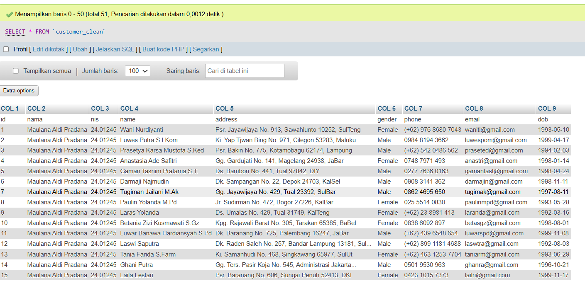
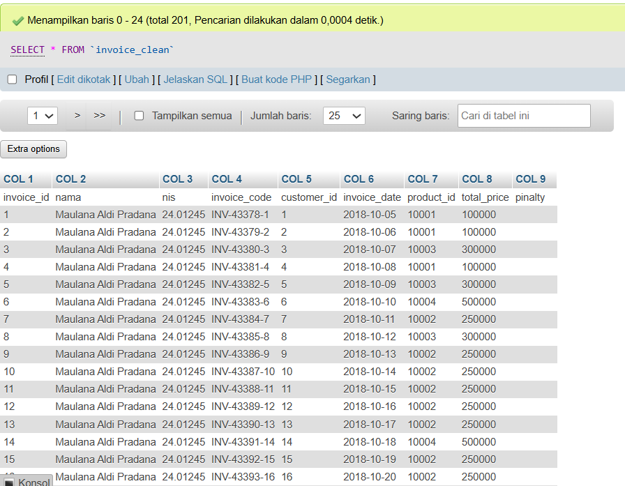
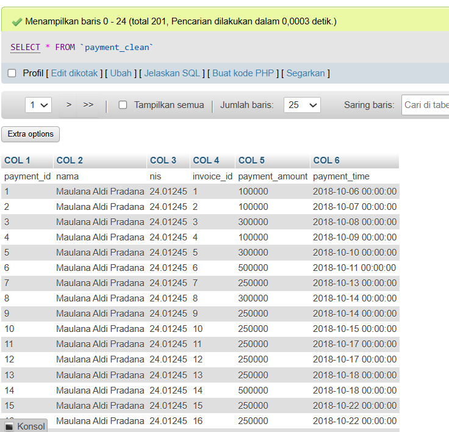
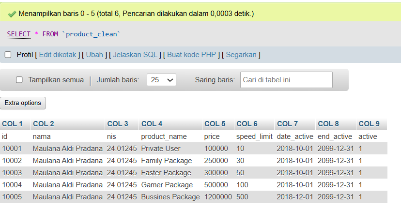
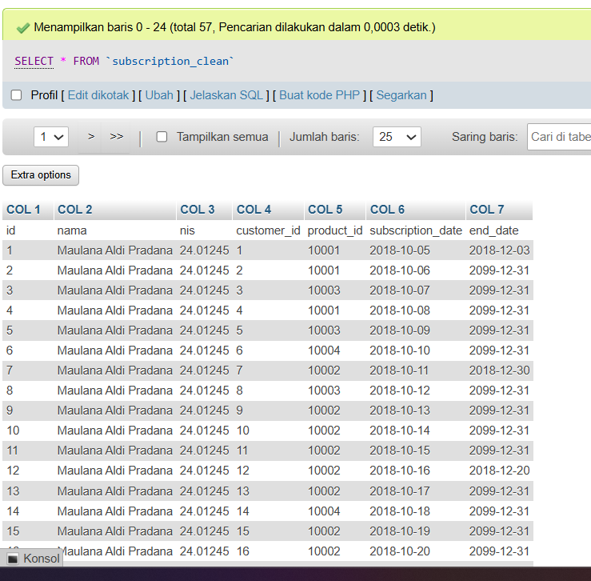

````md
# Project 08 - Clean & Transform Data

## 1. Project Overview

Project 08 focuses on cleaning and transforming five datasets before importing the processed data into SQL.

The datasets used in this project are:

- Customer
- Invoice
- Payment
- Product
- Subscription

The main objective of this project is to prepare the datasets, add the required student identity information, validate the cleaned data, and import each dataset into SQL according to its respective name.

---

## 2. Environment

The data cleaning and transformation process was performed using:

- Google Colab
- Python
- Pandas

The processed datasets were then imported into:

- XAMPP
- MySQL
- phpMyAdmin

---

## 3. Dataset

The five datasets used in this project are:

```text
Customer.txt
Invoice.txt
Payment.txt
Product.txt
Subscription.txt
````

Each dataset was processed separately using Pandas.

The resulting cleaned files are:

```text
customer_clean.csv
invoice_clean.csv
payment_clean.csv
product_clean.csv
subscription_clean.csv
```

---

## 4. Cleaning & Transformation Process

The general process applied to the datasets includes:

1. Reading the dataset using Pandas.
2. Cleaning column names.
3. Cleaning text values.
4. Converting ID columns into appropriate numeric types.
5. Converting date columns into datetime format where required.
6. Adding student name and NIS columns.
7. Checking missing values.
8. Checking duplicate rows.
9. Validating important ID relationships where applicable.
10. Exporting the cleaned dataset into CSV format.

The student identity information added to each dataset is:

```text
Nama : Maulana Aldi Pradana
NIS  : 24.012459
```

The `nama` column is placed as the second column in each dataset, following the instructions from the industry material.

---

# 5. Customer

The Customer dataset contains customer information.

The cleaned dataset contains:

```text
id
nama
nis
address
gender
phone
email
dob
```

The cleaned result was exported as:

```text
customer_clean.csv
```

### Evidence



---

# 6. Invoice

The Invoice dataset contains invoice and transaction information.

The cleaned dataset contains:

```text
invoice_id
nama
nis
invoice_code
customer_id
invoice_date
product_id
total_price
pinalty
```

The cleaned result was exported as:

```text
invoice_clean.csv
```

The `pinalty` column contains missing values in the original dataset. These values were retained rather than changed arbitrarily because there was no instruction to replace them with another value.

### Evidence



---

# 7. Payment

The Payment dataset contains payment information related to invoices.

The cleaned dataset contains:

```text
payment_id
nama
nis
invoice_id
payment_amount
payment_time
```

The cleaned result was exported as:

```text
payment_clean.csv
```

The relationship between Payment and Invoice is based on:

```text
payment.invoice_id
        ↓
invoice.invoice_id
```

### Evidence



---

# 8. Product

The Product dataset contains information about the available products or packages.

The cleaned dataset contains:

```text
id
nama
nis
product_name
price
speed_limit
date_active
end_active
active
```

The cleaned result was exported as:

```text
product_clean.csv
```

The Product ID was also validated against the Product ID referenced by the Invoice dataset.

### Evidence



---

# 9. Subscription

The Subscription dataset contains customer subscription information.

The cleaned dataset contains:

```text
id
nama
nis
customer_id
product_id
subscription_date
end_date
```

The cleaned result was exported as:

```text
subscription_clean.csv
```

The relationships were validated using:

```text
subscription.customer_id
        ↓
customer.id
```

and:

```text
subscription.product_id
        ↓
product.id
```

No invalid Customer ID or Product ID was found during validation.

### Evidence



---

# 10. Data Validation

After the cleaning and transformation process, the datasets were validated using Pandas.

The validation included:

* File availability
* Number of records
* Column structure
* Student name
* Student NIS
* Missing values
* Duplicate rows
* Important ID relationships

The final dataset sizes are:

| Dataset      | Records |
| ------------ | ------: |
| Customer     |      50 |
| Invoice      |     200 |
| Payment      |     200 |
| Product      |       5 |
| Subscription |      56 |

---

# 11. SQL Import

After the cleaning and transformation process was completed, the resulting CSV files were imported into MySQL using phpMyAdmin.

The database contains five tables:

```text
customer
invoice
payment
product
subscription
```

The table names follow the names of the corresponding datasets.

The purpose of this process is to ensure that the cleaned data is available in a relational database and can be used for further SQL analysis.

---

# 12. Project Files

The Project 08 directory contains:

```text
Project 8/
├── README.md
├── notebook/
│   └── project-08-clean-transform.ipynb
├── data/
│   ├── customer_clean.csv
│   ├── invoice_clean.csv
│   ├── payment_clean.csv
│   ├── product_clean.csv
│   └── subscription_clean.csv
└── image/
    ├── customer.png
    ├── invoice.png
    ├── payment.png
    ├── product.png
    └── subscription.png
```

---

# 13. Learning Outcome

After completing Project 08, I understand how to:

* Import raw datasets into Pandas.
* Inspect dataset structures.
* Clean and transform tabular data.
* Standardize column names.
* Convert data types appropriately.
* Handle missing values without making unsupported assumptions.
* Add required identification information to datasets.
* Validate duplicate records.
* Validate relationships between related datasets.
* Export cleaned datasets into CSV format.
* Import processed datasets into MySQL using phpMyAdmin.

---

# 14. Conclusion

Project 08 completed the process of preparing five datasets for use in a relational database.

Each dataset was cleaned and transformed using Pandas, validated, and exported into a separate CSV file. The processed datasets were then imported into MySQL using phpMyAdmin as five separate tables.

This project provided practical experience in preparing raw data before storing and processing it in a database environment.

````

