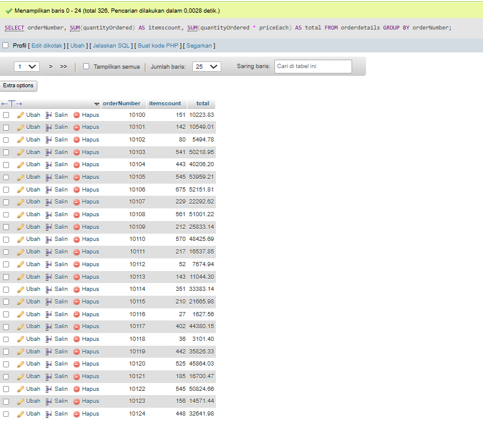
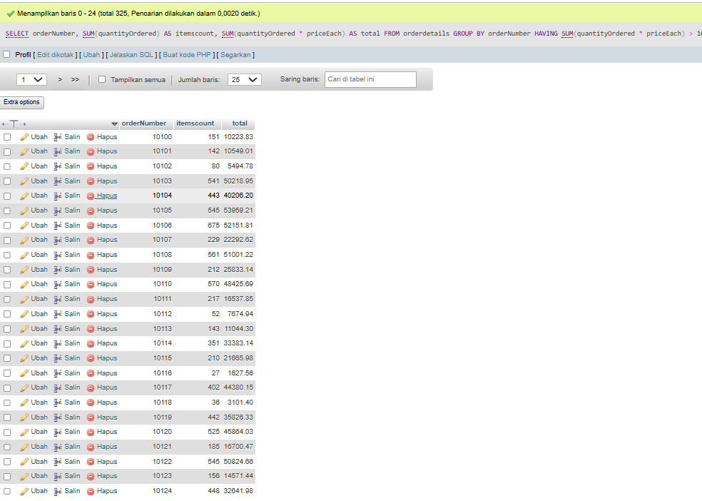
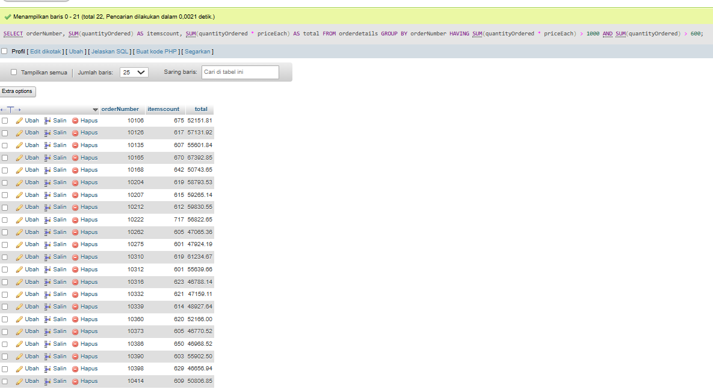
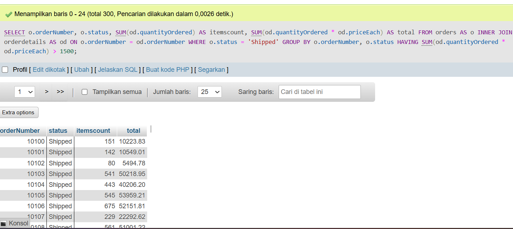

````md
# Project 10 - SQL HAVING

## 1. Project Overview

Project 10 focuses on using the `HAVING` clause in SQL to filter the results of aggregate functions.

The main concepts practiced in this project are:

- `GROUP BY`
- Aggregate functions
- `SUM()`
- `HAVING`
- Filtering aggregated results
- `INNER JOIN`
- `WHERE`
- Calculated total sales

The exercises use the `orders` and `orderdetails` tables.

---

## 2. Environment

The exercises were performed using:

- XAMPP
- MySQL / MariaDB
- phpMyAdmin

XAMPP was used as the local development environment, while MySQL/MariaDB was used to execute the SQL queries through phpMyAdmin.

---

## 3. Database and Tables

The main tables used in this project are:

```text
orders
orderdetails
````

The relationship between the two tables is based on:

```text
orders.orderNumber
        =
orderdetails.orderNumber
```

The `orderNumber` column is used to connect the order information with its corresponding order detail records.

The `orderdetails` table contains information such as:

```text
orderNumber
productCode
quantityOrdered
priceEach
```

The `orders` table contains information such as:

```text
orderNumber
status
```

---

# 4. Quiz Exercises

## Quiz 1.1 - GROUP BY and Aggregate Functions

### Objective

Display the total quantity of items and total sales for each order.

The `itemscount` value is calculated using:

```text
SUM(quantityOrdered)
```

The total sales value is calculated using:

```text
SUM(quantityOrdered * priceEach)
```

### Query

```sql
SELECT
    orderNumber,
    SUM(quantityOrdered) AS itemscount,
    SUM(quantityOrdered * priceEach) AS total
FROM orderdetails
GROUP BY orderNumber;
```

### Explanation

The query groups the records based on `orderNumber`.

For each order, the query calculates:

```text
itemscount = total quantity ordered
total      = total sales
```

The `SUM()` function is used to calculate the aggregate values.

### Evidence



---

## Quiz 1.2 - HAVING Total Sales > 1000

### Objective

Display orders whose total sales are greater than 1000.

### Query

```sql
SELECT
    orderNumber,
    SUM(quantityOrdered) AS itemscount,
    SUM(quantityOrdered * priceEach) AS total
FROM orderdetails
GROUP BY orderNumber
HAVING SUM(quantityOrdered * priceEach) > 1000;
```

### Explanation

The `HAVING` clause is used to filter the result after the data has been grouped and aggregated.

The condition used is:

```text
total sales > 1000
```

The filtering is performed using:

```sql
HAVING SUM(quantityOrdered * priceEach) > 1000
```

This is different from `WHERE`, which filters individual rows before the aggregation process.

### Evidence



---

## Quiz 1.3 - HAVING Multiple Conditions

### Objective

Display orders that have:

```text
total sales > 1000
```

and:

```text
itemscount > 600
```

### Query

```sql
SELECT
    orderNumber,
    SUM(quantityOrdered) AS itemscount,
    SUM(quantityOrdered * priceEach) AS total
FROM orderdetails
GROUP BY orderNumber
HAVING
    SUM(quantityOrdered * priceEach) > 1000
    AND SUM(quantityOrdered) > 600;
```

### Explanation

The query uses two conditions in the `HAVING` clause.

The first condition checks the total sales:

```sql
SUM(quantityOrdered * priceEach) > 1000
```

The second condition checks the total number of items:

```sql
SUM(quantityOrdered) > 600
```

Only orders that satisfy both conditions are displayed.

### Evidence



---

# 5. Quiz 2 - JOIN, WHERE, GROUP BY and HAVING

## Objective

Join the `orders` and `orderdetails` tables and display orders with:

```text
status = 'Shipped'
```

and:

```text
total sales > 1500
```

### Query

```sql
SELECT
    o.orderNumber,
    o.status,
    SUM(od.quantityOrdered) AS itemscount,
    SUM(od.quantityOrdered * od.priceEach) AS total
FROM orders AS o
INNER JOIN orderdetails AS od
    ON o.orderNumber = od.orderNumber
WHERE o.status = 'Shipped'
GROUP BY
    o.orderNumber,
    o.status
HAVING SUM(od.quantityOrdered * od.priceEach) > 1500;
```

### Explanation

The query combines the `orders` and `orderdetails` tables using:

```sql
INNER JOIN orderdetails AS od
    ON o.orderNumber = od.orderNumber
```

The `WHERE` clause filters orders based on their status:

```sql
WHERE o.status = 'Shipped'
```

The data is then grouped by:

```text
orderNumber
status
```

After aggregation, the `HAVING` clause filters the results based on total sales:

```sql
HAVING SUM(od.quantityOrdered * od.priceEach) > 1500
```

The query therefore combines several SQL concepts:

```text
INNER JOIN
    ↓
WHERE
    ↓
GROUP BY
    ↓
SUM()
    ↓
HAVING
```

### Evidence



---

# 6. SQL Concepts Practiced

| Concept        | Purpose                                       |
| -------------- | --------------------------------------------- |
| `GROUP BY`     | Group records based on order number           |
| `SUM()`        | Calculate aggregate values                    |
| `HAVING`       | Filter aggregated results                     |
| `WHERE`        | Filter records before aggregation             |
| `INNER JOIN`   | Combine related records from two tables       |
| `ON`           | Define the relationship between joined tables |
| `AS`           | Give an alias to calculated columns           |
| Arithmetic `*` | Calculate total sales                         |

---

# 7. Query Processing

The main processing flow used in Project 10 can be summarized as:

```text
FROM
  ↓
INNER JOIN
  ↓
WHERE
  ↓
GROUP BY
  ↓
SUM()
  ↓
HAVING
  ↓
Result
```

For Quiz 1, the process starts directly from `orderdetails`:

```text
orderdetails
     ↓
GROUP BY orderNumber
     ↓
SUM()
     ↓
HAVING
     ↓
Result
```

For Quiz 2, the process involves two related tables:

```text
orders
   │
   │ INNER JOIN
   ▼
orderdetails
   ↓
WHERE status = 'Shipped'
   ↓
GROUP BY
   ↓
SUM()
   ↓
HAVING total > 1500
   ↓
Result
```

---

# 8. Learning Outcome

After completing Project 10, I understand how to:

* Group data using `GROUP BY`.
* Use aggregate functions such as `SUM()`.
* Calculate total item quantities.
* Calculate total sales for each order.
* Use `HAVING` to filter aggregated results.
* Use multiple conditions inside `HAVING`.
* Understand the difference between `WHERE` and `HAVING`.
* Combine tables using `INNER JOIN`.
* Use table aliases to make JOIN queries easier to read.
* Combine `JOIN`, `WHERE`, `GROUP BY`, and `HAVING` in a single query.

---

# 9. Project Files

```text
Project-10/
├── image/
│   ├── quiz-1.1.png
│   ├── quiz-1.2.png
│   ├── quiz-1.3.png
│   └── quiz-2.png
│
└── queries.sql
```

---

# 10. Conclusion

Project 10 provided practical experience in filtering aggregated SQL data using the `HAVING` clause.

The first quiz focused on grouping order details and calculating item quantities and total sales. The results were then filtered using `HAVING` based on total sales and item quantity.

The second quiz extended the concept by joining the `orders` and `orderdetails` tables. The query used `WHERE` to filter shipped orders and `HAVING` to filter orders based on their total sales.

Through this project, I practiced combining `INNER JOIN`, `WHERE`, `GROUP BY`, aggregate functions, and `HAVING` to perform more structured SQL data analysis.

```

Struktur folder yang kamu punya sekarang sudah pas dengan bagian `Project Files` di atas.
```
